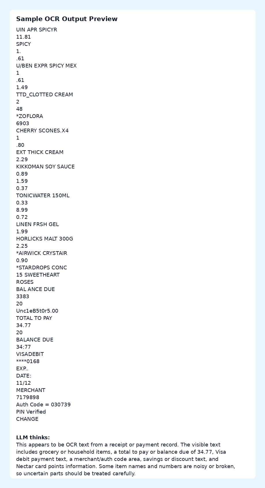

# Test Case 1: Receipt OCR

This folder contains a small proof sample for the OCR RAG workflow.

## Files

- `input_image.jpg` - source image used for OCR testing.
- `extracted_text.txt` - OCR text saved by the backend.
- `sample_output.md` - expected app-style output format.
- `output_preview.png` - visual preview of the output format.

## Notes

- The source image is used only as a local OCR test sample.
- The image includes visible source/watermark information.
- The OCR text is intentionally imperfect because the input is a real noisy receipt-style image.
- The LLM section should summarize only what can be understood from the OCR text and clearly avoid unsupported assumptions.

## Preview

